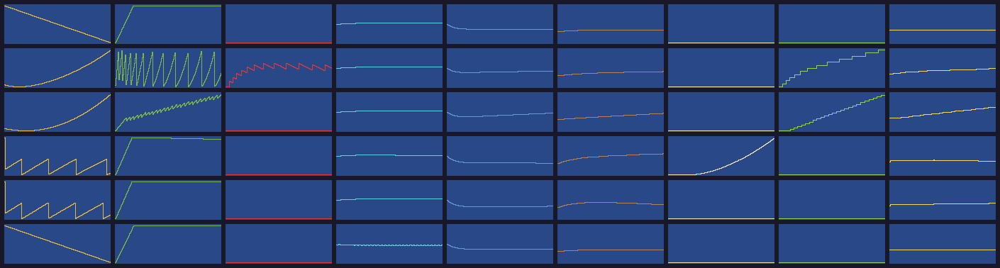

# The economy as a system — stocks, flows, feedback (2026-09-30)

Maddy: *"the community effort that just ticks up endlessly doesn't make an engaging gameplay loop. we need
to take inspiration from donella meadows and dynamical systems in modeling this."*

The model lives in `src/economy/model.ts` (pure, headless). Each loop's directional behaviour is pinned in
`tests/economy/model.test.ts`; mutating a loop's constant fails the suite. This builds on
[classic-ui-and-economy.md](classic-ui-and-economy.md) §D and its decisions.

## Why the old effort fails as a game

Effort today is an **accumulator with an inflow and no limit**: `effort += max(1, wellbeing)` every tick.
- There's no balancing loop, no delay, no capacity and no upkeep.
- Every choice reduces to "buy it eventually", and waiting is always the right move.

Meadows' diagnosis fits exactly: a stock with no outflow and no limit has only one behaviour, monotonic
growth.

## Stocks

| Stock | Range | Fills from | Drains to | Character |
|---|---|---|---|---|
| **Funds** | money | taxes (base × per-class rate) | upkeep of the built fabric, police, projects | the the classic city-builder budget |
| **Effort** | 0 … capacity | neighbours' free time: households × wellbeing × trust × (1 − burnout) | commons tending (first), then projects | **perishable**: fills to a capacity set by social infrastructure; the excess is time lived, not banked |
| **Burnout** | 0 … 0.9 | running on empty: demand above regeneration while the reserve is below ⅕ of capacity | rest, slowly | throttles regeneration — the delay that makes over-extension overshoot |
| **Goodwill** | 0 … 100 | repairs, delivery | harms (blackouts, police violence, takings, displacement) — losses outweigh gains | read from civic trust (one source of truth, see Integration) |
| **Approval** | 0 … 100 | — | — | a *perceived* level: a first-order delay chasing wellbeing, goodwill and tax pain |
| **Rent** | 0 … 1 | unprotected land value + tax pass-through, with a lag | — | drives displacement when it outruns what households can bear |

## Loops

- **R1 commons (reinforcing).** Wellbeing brings effort, effort builds commons, and commons raise wellbeing.
- **B1 limits to growth (balancing, delayed).** Every commons work needs tending, so the free effort
  shrinks. Pushing past regeneration with an empty reserve brings burnout, burnout cuts regeneration, and
  the commons wither.
- **R2 land value (reinforcing).** Amenities raise land value, which raises the tax base, which funds more
  amenities.
- **B2 displacement (balancing, delayed).**
  - Land value pushes up rent, rent drives displacement, and the displaced join the unhoused, which lowers
    goodwill and wellbeing.
  - This applies to *green* amenities too: green gentrification falls out of the model.
  - Protected land (land trusts, co-ops, communes) cuts rent off from land value.
- **B3 tax burden (balancing).** Higher taxes lower approval and raise rents (landlords pass them on).
- **Shifting the burden.** Police spending buys a small, quick approval lift. It costs goodwill, which
  slows effort, and that is the slow structural harm.

## What the model does (scenario harness, 30 in-game days)

Rows: passive · commons sprint · paced commons · growth (12% tax) · growth + land trusts · police-heavy.
Columns: funds · effort · burnout · goodwill · approval · rent · displaced · commons · wellbeing.

| After 30 days | Commons | Burnout | Wellbeing | Approval | Displaced |
|---|---|---|---|---|---|
| Passive | 0 | 0 | 0.35 | 37 | 0 |
| Commons sprint: spend effort as soon as it's there | 12 | 0.49 | 0.49 | 43 | 0 |
| **Paced commons: keep a 60% buffer, build within regeneration** | **25** | **0** | **0.64** | **48** | 0 |
| Growth: 12% tax, money-funded amenities | 0 | 0 | 0.37 | 31 | **35** (accelerating after a ~10-day delay) |
| Growth + land trusts | 0 | 0 | 0.42 | 34 | **0** (rent falls back) |
| Police-heavy | 0 | 0 | 0.35 | 36 | 0 (goodwill erodes; the treasury bleeds) |

What this shows:
- **Faster is slower.** The sprint builds half as much and burns people out; keeping the buffer is the
  skill.
- **Displacement arrives late.** Nothing looks wrong for days. That makes the info maps (Meadows' leverage
  point 6, information flows) part of the economy, not decoration.
- **Protection is structural.** Land trusts change the system's structure, where any parameter tweak
  wouldn't.

## The gameplay loop this gives

1. **Earn and spend.** Effort regenerates; each project spends it, and each commons work adds tending. The
   question is no longer "can I afford it" but "can we keep it alive, and do we have slack?"
2. **Pace.** Running the reserve to empty burns the city out. Spending from a buffer doesn't.
3. **Balance the budget.** Fund the fabric's upkeep with taxes. Taxes cost approval and push rents.
   Highways and plants carry heavy upkeep.
4. **Watch what you can't see yet.** Rent and displacement lag land value. The maps show the pressure
   building before people are pushed out.
5. **Change the structure.** Land trusts, circles and participatory budgeting change the loops themselves,
   not just the numbers.

## Leverage points → the Commons tree (proposal)

Meadows' twelve leverage points, from weakest to strongest, map onto what the practices unlock:

| Leverage point | Practices that act there |
|---|---|
| Parameters (12) | tax rates, police budget — always available, weakest |
| Buffers (11) | community spaces, social infrastructure → larger effort capacity |
| Stock-and-flow structure (10) | transit, road diets (what flows where) |
| Delays (9) | early-warning data on the maps |
| Balancing loops (8) | rent stabilisation; tending shared across neighbourhoods |
| Reinforcing loops (7) | gift economy (effort that multiplies), mutual aid |
| Information flows (6) | the info maps, participatory budgeting (decisions see their effects) |
| Rules (5) | land trusts, eminent domain (the taking), the consent buyout |
| Self-organisation (4) | communes, co-ops, neighbourhood assemblies |
| Goals (3) | wellbeing over growth, made explicit |
| Paradigm (2) / transcending it (1) | the late tree |

## Integration with the running city (next)

**City readings.** Each economy tick (one in-game hour) the city supplies:
- **Households:** occupancy.
- **Wellbeing:** the existing composite, normalised.
- **Land value:** the live mean.
- **Protected share:** homes in co-ops, communes, and on land-trust land.
- **Tax base per class:** the sum of occupied land value by R, C and I.
- **Upkeep:** a per-kind table.
- **Tending:** a per-commons-kind table.
- **Social infrastructure:** gathering places plus circles.
- **Harms:**
  - blackout feeder-hours;
  - police-violence incidents;
  - takings.
- **Repairs:** civic repair events.

**Other wiring:**
- **Goodwill = citywide civic trust.** Economy shocks (takings, displacement, blackouts) are applied to
  civic trust, so there is one trust stock, not two.
- **Displacement feeds the unhoused count.**
- **Communal effort becomes the economy's effort stock.** Tech costs and community builds spend it; the
  old endless accrual is retired.
